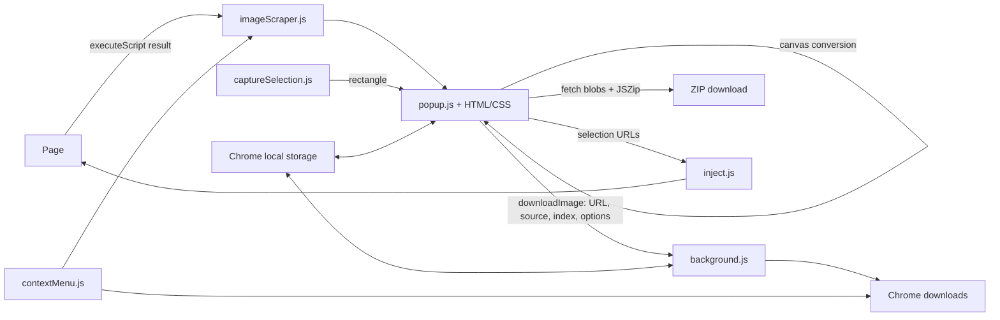

# Architecture and bug audit — 2026-10-02

## Review scope

Reviewed the authored runtime JavaScript, manifest, popup HTML/CSS, onboarding HTML,
packaging script, and existing helper tests. Traced scraper injection, storage,
selection messages, conversion, ZIP creation, filename shaping, capture overlays,
and popup/worker lifecycle. Checked vendored dependency entry points and packaging;
this is not a line-by-line audit of minified jQuery, jQuery UI, or JSZip internals.
The 54 locale JSON files are data consumed by Chrome i18n, not separate controllers.
Store artwork sources are presentation assets outside the extension runtime.

## Runtime map

| Component | Responsibilities and connections |
| --- | --- |
| `manifest.json` | MV3 registration, toolbar popup, worker, automatic HTTP(S) content script, host access, downloads/storage/scripting/DNR/side-panel/context-menu permissions, localization, action shortcut. Root directory is the loadable extension. |
| `bg-entry.js` | Registers first-install onboarding; synchronously imports filename tokens, context menu, and worker core. |
| `background.js` | Prefixed local storage, display-mode settings and gesture-bound action handler, runtime message routing, popup port cleanup, per-request image downloads, update migration. Imports the filename sanitizer. Contains referer-rule helpers, but no message handler or caller currently invokes `addRefererRule`; their presence does not mean hotlink protection is handled. |
| `contextMenu.js` | Registers menu on installation/startup, injects the scraper into all frames, flattens/deduplicates its results, directly downloads discovered URLs. This route does not use the popup conversion or ZIP UI. |
| `imageScraper.js` | Injected IIFE returning a Promise for `executeScript`; discovers DOM/srcset/lazy attributes, picture sources, metadata, video posters, links, object/embed, SVG, CSS backgrounds, raw HTML URLs, and open shadow roots. Deduplicates, reads full-resolution preference, optionally rewrites/group-collapses variants. |
| `popup.js` | Reads prefs and active tab, opens cleanup port, injects scraper, merges frame results, renders cards, probes dimensions, filters/sorts/selects, downloads or converts or ZIPs, saves prefs, runs many-files dialog and capture/cropping. Selection now lives in state rather than only disposable DOM cards. |
| `popup.html` / `popup.css` | Toolbar, cards, filter menus, naming/conversion/ZIP controls, dialogs; CSS contains visibility conditions that the controller must satisfy. |
| `popup-bridge.js` | Copy/export visible selected-or-all URLs, keyboard shortcuts, independent full-resolution toggle, select-all SVG restoration, accessibility state synchronization. Does not duplicate the main controller. |
| `inject.js` | Automatically attached page listener, selected-image highlighting and cleanup, capture teardown event, page-message bridge requesting extension UI. Operates in the isolated content-script context. |
| `captureSelection.js` | On-demand page overlay, drag rectangle normalization, Escape/cleanup, reinjection guard. Sends CSS coordinates and device pixel ratio; popup captures and crops the bitmap. |
| `filenameTokens.js` | Pure token resolution, date/domain/index formatting and token-level illegal-character replacement. |
| `sanitize.js` | Global filesystem-name sanitizer used by popup ZIP naming and worker image naming. |
| `welcome.html` / `welcome.js` | Installation onboarding, localization, shortcut lookup, Get Started/Escape tab dismissal. |
| `733.js`, `external/` | Vendored JSZip (webpack chunk, lazy loaded and adapted by popup.js), jQuery and jQuery UI (loaded by HTML; main controller is vanilla JS). Licenses must travel with the files. |
| `scripts/build-zip.sh` | Stages explicit runtime files, locales/fonts/external/images, licenses; validates manifest and produces root-level extension ZIP. |



## Ten fixes

The numbers correspond to `docs/superpowers/tests/bug-regressions.test.cjs`.

| # | Concrete failure and reproduction | Cause | Fix |
| --- | --- | --- | --- |
| 1 | After a scan, download controls stay hidden; Preferences/many-files dialogs do not appear; filter menus cannot open; selecting Custom Name leaves its input hidden. | Controller never supplies required visibility state; clearing inline display does not override stylesheet `display:none`; filter menus have no toggle handlers; custom-name CSS reads an attribute never updated by the controller. | Reveal download control/count label, restore stylesheet layout and override hidden displays, wire filter-menu toggles and outside clicks, derive custom-field visibility from selected option. Ignore clicks/keyboard events from inside the download menu so editing does not toggle its parent. |
| 2 | Select Large before previews load: small images remain in the grid. Default pixel sort remains discovery order. | Image load/probe callbacks update metadata but never reapply filters or sort. | Debounce redraws after dimensions become available. Probe all discovered URLs, including initially filtered cards, and suppress concurrent duplicate probes. Avoid repeatedly redrawing for unchanged thumbnail dimensions. |
| 3 | Select images, change sort or URL filter, then return: selections disappear. | Rendering deletes cards; their checkbox/class state is the only selection record. | Store selected URLs in state; restore card/checkbox state on redraw; keep hidden selections through filtering; send the visible selection to the page after redraw. A fresh scan starts a fresh selection. |
| 4 | Click custom size once, then edit width/height: filtering still uses old values. | Only clicking the custom option reads the inputs. | Input listeners update the custom filter, bounds, selected option, and grid immediately. |
| 5 | Batch custom `{index}` names always use 1; worker filename suggestions contain absolute paths; conversion loses source extension/index; unrelated archive downloads inherit image naming settings. | Popup discards index; worker tries to infer it from URL queries and consumes global mutable settings; `DownloadItem.filename` is an absolute path; all downloads from the extension are rewritten. | Send source URL, index, and an options snapshot with each image request. Worker supplies sanitized relative filenames at initiation. Converted files derive extension from output MIME. URLs stay unchanged, including signed queries. Remove the legacy filename listener: native testing proved it interfered with the filename supplied to `download()`. Ordinary ZIP/context-menu downloads retain their own naming. |
| 6 | ZIP a percent-encoded inline SVG: entry contains `%3Csvg…` rather than SVG bytes. | Non-base64 data payload is UTF-8 encoded without decoding percent escapes. | Decode escapes into bytes, preserving UTF-8 text and arbitrary binary bytes such as `%FF%00`. |
| 7 | Update while local storage write fails: synced settings are permanently cleared. | Migration clears source storage regardless of copy error. | Keep synced settings when local write reports an error; clear only after successful copying. |
| 8 | Scan an unloaded/lazy image whose natural dimensions are zero: it is absent. | Tracking-pixel check classifies 0×0 as a pixel before reading its source/lazy attributes. | Exclude only completed, actual 1×1 images. Unloaded and failed images remain eligible for source discovery. |
| 9 | An image URL in embedded HTML/JSON ends in `.jpeg?signature=…` or `.tiff`: scraper creates a truncated URL. | Raw URL regex discards queries and matches shorter alternatives inside longer extensions. | Require an extension boundary, preserve query/fragment, prefer full extension alternatives, and decode HTML `&amp;` query separators. |
| 10 | Select A+B, then deselect B: B stays highlighted. Closing the popup leaves shadow-root highlights. | Highlight application only adds classes; cleanup searches only the light DOM. | Replace highlights with each incoming selection and traverse nested open shadow roots for both application and cleanup. |

### Download naming behavior

Per-request naming uses the source URL's basename; converted/data images use their
output MIME extension. It does not fetch a server's Content-Disposition filename.
A user-specified folder is sanitized as one segment. Context-menu downloads and ZIP
archive names are passed through to Chrome rather than renamed by stale image options.
Chrome requires supplied filenames to be relative to Downloads; absolute paths and
back-reference segments are rejected. See the [Chrome downloads API](https://developer.chrome.com/docs/extensions/reference/api/downloads#type-DownloadOptions).

## Verification

- Regression suite: **26/26 pass**. The initial ten-case suite was also run against original HEAD source in a temporary directory and yielded **10/10 failures** before its subsequent expansion. Tests use VM-loaded real controllers and Chrome/DOM doubles; they do not load an installed extension. One case generates/reopens a ZIP using the actual vendored JSZip module.
- Existing cases: filename tokens **21/21**, full-resolution rewriting **30/30**, frame flattening **7/7**, URL deduplication **5/5**.
- Browser smoke checks with actual popup HTML/CSS/JS and mocked Chrome APIs: download/menu visibility, custom-name input, editing without menu closure, 35-image warning/cancel, Preferences open/close, size-menu visibility, custom minimum width, dimension-based pixel sorting, selection preserved after filtering. Passed.
- Syntax checks on changed runtime JavaScript and `git diff --check`: passed.
- Packaging script produced `/private/tmp/image-download-audit-2026-10-02.zip` (148 files); all root JavaScript passes syntax checks, and the manifest and all 54 locale JSON files parse.
- Native unpacked-extension tests were performed after the user completed loading the folder. Chrome's extension details confirmed this repository and extension ID `nmiacnlifgkppmfadjegbkkpldebfaok`. Keyboard popup, toolbar side panel, three-image scan/dimensions, saved naming settings, native indexed downloads and ZIP, and side-panel tab switching passed. SHA-256 checks confirmed all three downloads and ZIP entries match the fixture source bytes. Capture was exercised through synthetic rectangle events entered in Chrome DevTools because native mouse automation failed; the real capture API produced a 200×200 PNG for a 100×100 CSS-pixel selection on Retina, with no dimming overlay. Physical dragging remains unverified after the permission fix. Service-worker suspension, protected hosts and iframe injection remain untested natively.

Run the new tests with:

```sh
node --test docs/superpowers/tests/bug-regressions.test.cjs
```

Manual checks: load/reload this repository in `chrome://extensions`, scan a page with
lazy images and signed URLs, test each table reproduction, download a custom-indexed
batch and converted image, ZIP an inline SVG, and inspect actual output files.

## Continued fixes and validation

The continuation resolves the previously listed preferences, side-panel activation,
page-message discriminator, ZIP loading/fetch/naming/conversion, and capture issues.
It also addresses additional defects found during review and browser testing:

| Area | Result | Regression cases |
| --- | --- | --- |
| Preferences | Reveal checkbox works, saved naming/conversion values populate both dialogs, saving updates regular downloads, disabling options resets defaults. Cancelled general checkbox edits are reset when the dialog reopens. | 11 |
| ZIP fetch/load | Non-2xx responses are omitted; fetch and conversion have deadlines; library failures reject and allow retry; no successful images means no empty archive; partial failures are reported. | 12, 13, 21 |
| ZIP entry behavior | Naming tokens, MIME-derived extensions, per-domain/custom folders, conversion settings and collision suffixes apply to entries. Each job snapshots its options. | 14; browser archive inspection |
| Capture validation | Accept only a pending request from the associated top-level tab, check active tab/window before and after capturing, validate coordinates, scale using the source viewport and clamp crops. | 15, 25 |
| Filesystem names | Prefix reserved Windows names (including names with extensions/trimmed whitespace), cap UTF-8 byte length, preserve ordinary extensions and whole Unicode code points. | 16 |
| Full-resolution URLs | Preserve known signed/authenticated CDN queries and signed Cloudinary path segments; rewriting them would invalidate access. | 17 |
| Side panel | Use an explicit panel-view URL for correct layout, await/report API failures, and synchronously open through `action.onClicked` so Chrome grants `activeTab`. Disable automatic panel action behavior, which opened the panel without the capture grant in native tests. Remove deferred automatic opening after storage. | 18 |
| Page bridge | Forward `msg: openExtension`, matching worker dispatch; report actual API success/failure. | 19 |
| Capture overlay | Tear down before scheduling two animation frames and sending crop coordinates; include source viewport dimensions. Declare `activeTab` in the manifest; missing permission was reproduced natively. If the current tab has no grant, instruct the user to click the toolbar icon and retry. | 20; permission case; native capture |
| Vendored JSZip | The browser test proved `733.js` does not define a global JSZip: it registers webpack module 733. A small adapter instantiates that module, without modifying the vendor file or requiring a webpack runtime. | 22 |
| SVG data format | Recognize non-base64 data URIs terminated by a comma, keeping SVG type filters accurate. | 23 |
| Tab changes | Side panel follows active tabs/navigation within its own window; scan generation IDs prevent old callbacks from replacing new results; reset pending capture when the associated tab changes. | 24 |
| Other UI correctness | Bigger layout uses the CSS's actual `.bigger` container class; two-column state stays synchronized with Preferences; scrape errors appear in visible toasts instead of a spinner immediately hidden by completion. | Browser UI checks/code review |
| Filename templates | Cap index padding to 100 characters to prevent an oversized template from locking up token resolution. | Existing token suite; bounded loop review |

Additional browser checks used actual popup HTML/CSS/controllers, canvas conversion,
and the vendored JSZip module with mocked Chrome APIs. They verified side-panel
layout and capture-button visibility, preference/menu synchronization, a generated
ZIP with `same.png`, `same (2).png`, `same (3).png`, valid PNG signatures in all entries,
and converted regular-download indexes 1, 2, 3. These checks passed. Native browser
extension APIs were not mocked into a claim of installed-extension verification.

Side-panel behavior follows the [Chrome sidePanel API](https://developer.chrome.com/docs/extensions/reference/api/sidePanel): programmatic opening runs synchronously in `action.onClicked`. Capture uses the originating window's [captureVisibleTab API](https://developer.chrome.com/docs/extensions/reference/api/tabs#method-captureVisibleTab) with the gesture-scoped [activeTab permission](https://developer.chrome.com/docs/extensions/develop/concepts/activeTab). After switching to a tab without a grant, users must invoke the toolbar icon before capture.

## Remaining practical limitations

- Native mouse automation failed (`noWindowsAvailable` / `windowNotFoundAtPosition`), so the final capture flow used synthetic rectangle events in Chrome DevTools. Physical dragging, service-worker suspension, protected hosts, native iframe injection and native format conversion remain unverified. Temporary QA naming and side-panel settings were restored to the initial defaults.
- Full-resolution heuristics still infer unsigned original paths; some hosts will not provide those paths. No generic load-failure fallback to the original URL is implemented.
- Referer helpers remain uncalled; protected-host fetches/conversions can still fail or fall back to an unconverted download.
- Per-request and ZIP original naming uses URL basenames, not a server Content-Disposition filename.
- There is no visual baseline, screen-reader audit, or full localization behavior audit; JSON parsing alone is not translation validation.

All 26 regression cases and 63 pre-existing helper cases pass (**89 total**).
The release package was built for review only and was not published. The unpacked
repository was installed by the user and reloaded during native verification.

## Second audit pass — ten further fixes

Prior fixes were re-verified first: all 26 original regression cases and 63 helper
cases still pass. One prior fix had introduced a regression (B4). Tests B1–B10 sit at
the end of `docs/superpowers/tests/bug-regressions.test.cjs`. Each failed before its fix.

| # | Failure | Cause | Fix |
| --- | --- | --- | --- |
| B1 | Cloudinary `srcset` (`…/w_300,c_fill/a.jpg 300w, …`) yields broken half-URLs; a data URI after the first candidate is split. | Parser split on every comma; data-URI detection missed the leading space. | Follow the HTML candidate grammar: URL = non-whitespace run, separators after descriptors or a trailing comma. |
| B2 | Inline-SVG CSS backgrounds (`url("data:…<svg xmlns='…'>")`) are dropped. | `url()` regex stopped at the other quote character or `)`. | Separate double/single/unquoted alternatives and unescape `\"`. |
| B3 | Transparent PNG/WebP/SVG converted to JPEG has a black background. | Canvas alpha discarded by JPEG encoder. | Paint white before drawing when the target is JPEG. |
| B4 | `…/media/abc?format=jpg` or `/image?id=3` downloads as `imgi_1_abc` with no extension. Regression from fix 5: the old listener used Chrome's MIME-derived name. | Chrome does not append an extension to a supplied filename. | Infer from `format`/`fm`/`ext` query parameter, else HEAD `Content-Type` (5s timeout), else unchanged. |
| B5 | ZIPs of many images report "could not be fetched" for images that load fine. | All fetches/conversions start at once; each 30s timeout runs while queued behind per-host connection limits. | Bounded pool (6) preserving entry order. |
| B6 | `/v1.2/photo` shows type `2/PHOTO`; `.tif` files never match the TIFF type filter or TIFF conversion. | Extension taken from last dot in the whole path; no TIF alias. | Use last path segment; normalize TIF→TIFF. |
| B7 | Stop does nothing until the scan finishes, then discards everything. | Flag only checked in the completion callback. | Invalidate the scan generation and end the search UI immediately. |
| B8 | Broken URLs are re-requested (probe + thumbnail) on every grid re-render. | Probe error reset state without remembering failure. | `failed` flag skips probes and thumbnail loads for known-broken URLs. |
| B9 | A saved size filter hides images on open with no Clear control; Clear leaves stale min-size inputs. | Restored filters never called `showClearFilters`; Clear did not reset inputs. | Show Clear after restoring; reset inputs on Clear. |
| B10 | Any web page can open the extension popup/side panel at will via `postMessage({action:'imgdl_open'})`. | Bridge accepted unauthenticated page messages without a gesture. | Honor the request only with transient user activation. |

Not fixed (noted): referer helpers remain uncalled; context-menu downloads still
bypass the many-files confirmation; page highlighting cannot match full-resolution
rewritten URLs.

### Browser verification (second pass)

These checks loaded this unpacked extension in Chrome for Testing 153 (same extension ID) and ran
against a local fixture server. Downloads used Chrome's default handling with real files on disk.
- B1–B10: 21/21 checks passed. The checks covered: Cloudinary srcset URLs; inline SVG background;
  `.tif`/`/v1.2/` types and TIFF filter; no refetch of a 404 over 6 re-renders; `imgi_N_abc.png` named by HEAD `Content-Type`;
  a transparent PNG converted to JPEG with a white pixel; restored filter shows Clear; ZIP across
  20 hosts with at most 6 in flight and 20 ordered entries; Stop UI ends in about 30 ms with the late result ignored;
  the page bridge ignores an unprompted message and forwards a click-initiated one.
- Earlier fixes and core flows: 16/16 checks passed. The checks covered: controls revealed; page highlight and cleanup on close;
  selection kept through filters; select/deselect all; `{name}-{index:3}` in a subfolder; converted
  batch indexes; ZIP duplicate suffixes; Preferences save and persistence; copy URLs; the 35-image warning
  and cancel; side-panel layout.
- Confirmed Chrome behavior behind B4: a supplied filename without an extension is saved as-is.
  A wrong extension is corrected to the served MIME type.
- Not exercised: native toolbar/side-panel opening, physical drag capture, the context menu,
  and service-worker suspension.
